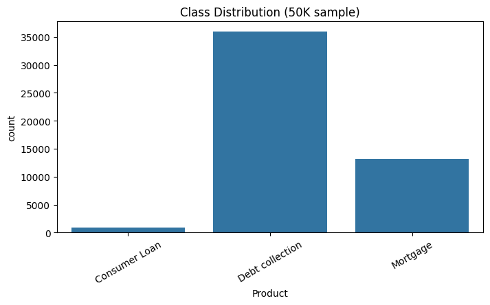
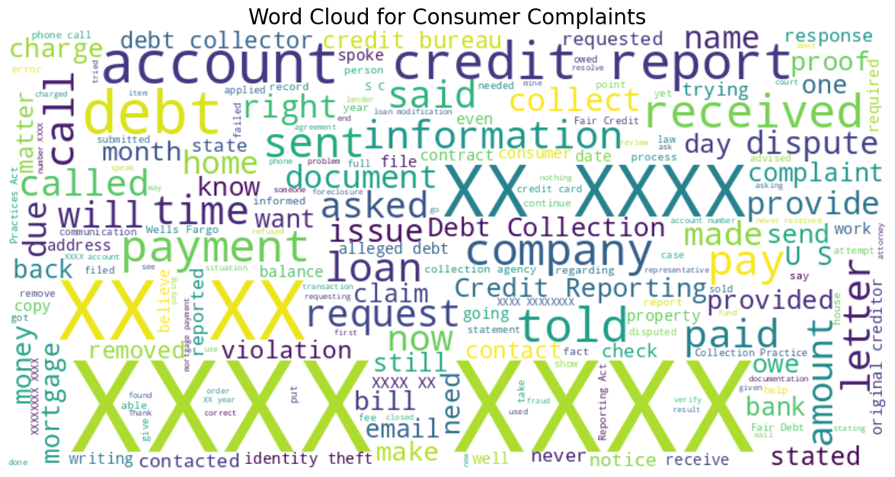
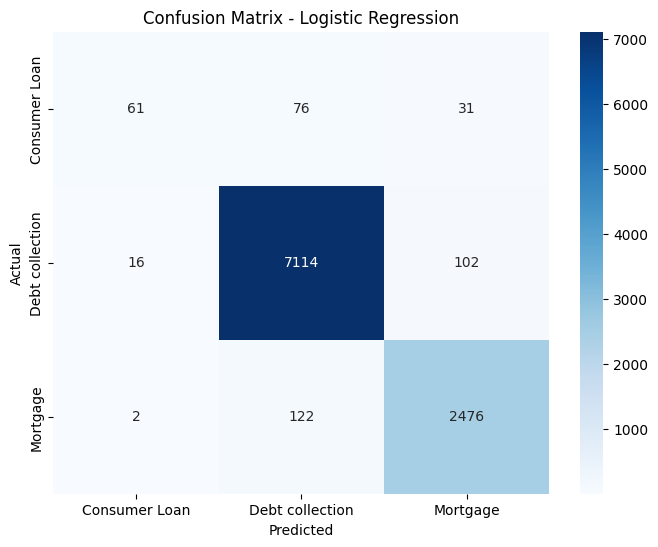
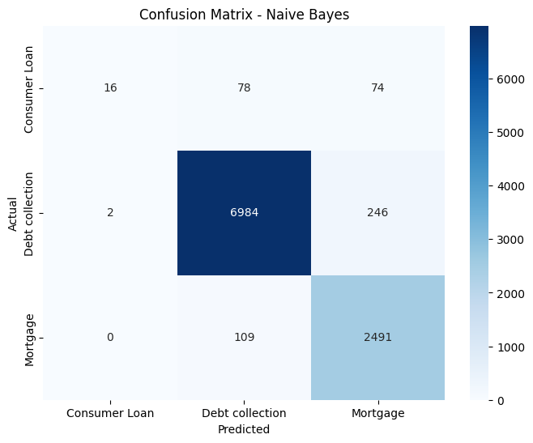
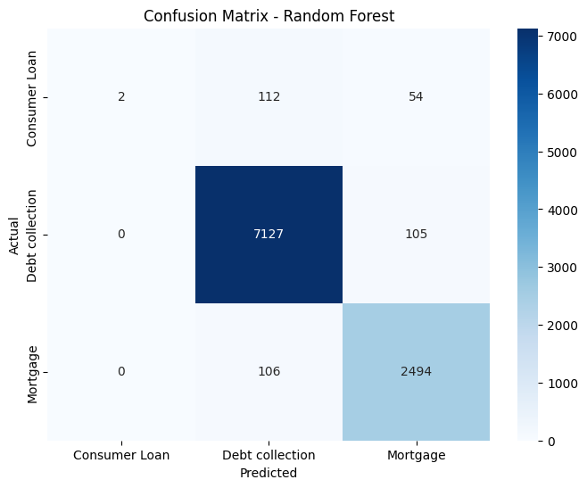
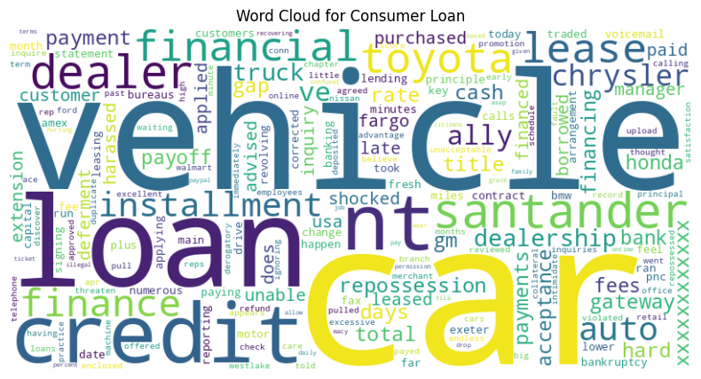
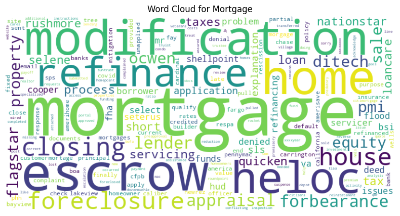
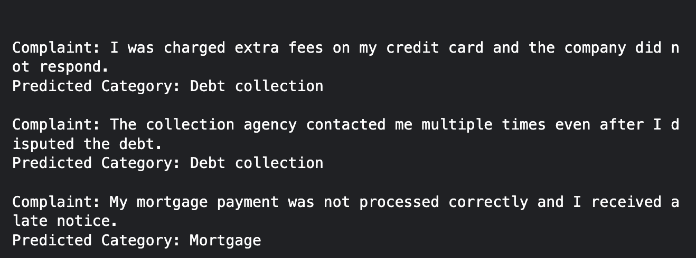

# Task 5 — Text Classification of Consumer Complaints

### Description

This project performs **text classification** on the Consumer Complaint dataset from [Consumer Finance](https://catalog.data.gov/dataset/consumer-complaint-database).  
The goal is to classify complaints into the following categories:

| Label | Category                           |
| ----- | ---------------------------------- |
| 0     | Credit reporting, repair, or other |
| 1     | Debt collection                    |
| 2     | Consumer Loan                      |
| 3     | Mortgage                           |

---

### Features

- Data Cleaning and Preprocessing
- Exploratory Data Analysis (EDA)
- Feature Engineering using TF-IDF
- Classification using multiple models:
  - Logistic Regression
  - Naive Bayes
  - Random Forest
- Evaluation with accuracy, precision, recall, F1-score
- Visualization:
  - Class distribution
  - Word clouds for top features
  - Confusion heatmaps for models

---

All steps are implemented in the Jupyter Notebook: [`task-5.ipynb`](task-5.ipynb)

---

### Screenshots

#### 1️ Class Distribution

Shows the distribution of complaints among the categories:

- 0 → Credit reporting, repair, or other
- 1 → Debt collection
- 2 → Consumer Loan
- 3 → Mortgage

---

#### 2️ Word Cloud of Complaints

Visual representation of the most frequent words in all complaints. This helps in understanding common keywords in the dataset.

---

#### 3️ Heatmap of Model Performance

Confusion matrix heatmap comparing all trained models (Logistic Regression, Naive Bayes, Random Forest) on the test dataset.

---

#### 4️ Top Words Word Cloud for Each Category

Shows the top words contributing to classification for each category based on Logistic Regression coefficients.

- Consumer Loan: 
- Debt Collection: 
- Mortgage: 

#### 5 predictions of the best model

---

### Conclusion

This task performs text classification on the Consumer Complaint Database, categorizing complaints into Credit Reporting, Debt Collection, Consumer Loan, and Mortgage. We cleaned the data, sampled 50,000 complaints, and converted the complaint text into TF-IDF features. Three models—Logistic Regression, Naive Bayes, and Random Forest—were trained and evaluated. Logistic Regression achieved the best performance with an accuracy of 96.5%, demonstrating an effective workflow for real-world text classification tasks.
